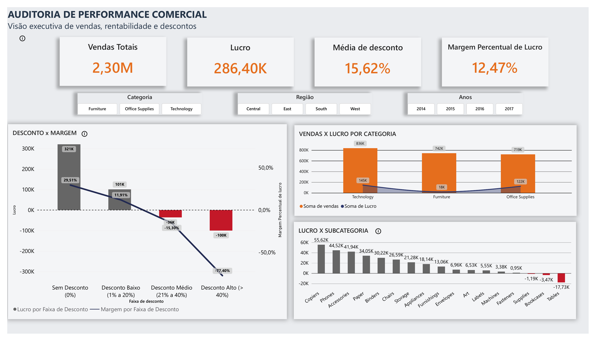
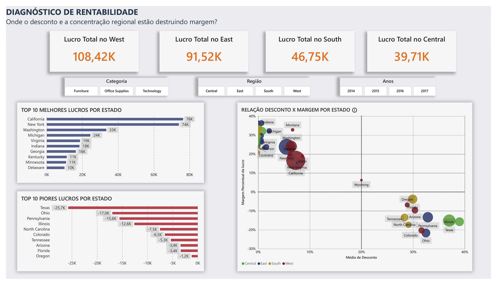
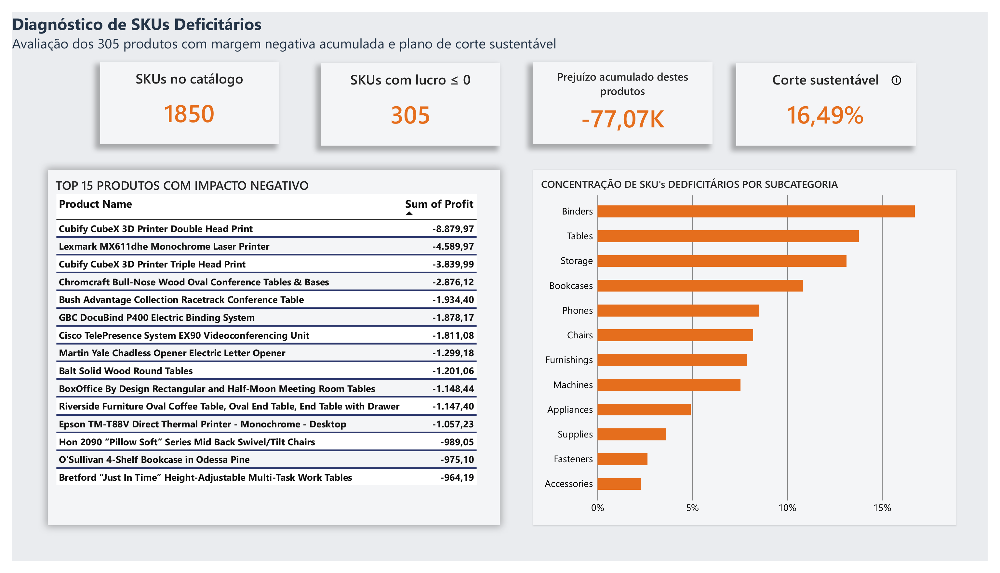

# Auditoria de Performance Comercial — Rede Varejista

  

> Projeto de análise de dados baseado no dataset público **Superstore**. Auditoria de rentabilidade comercial que identifica onde a empresa perde dinheiro e por quê.

## Principais Achados

- Correlação de **-0,86** entre desconto e margem — acima de **21% de desconto**, a operação entra no prejuízo.
- As subcategorias **Tables** e **Bookcases** destroem margem por excesso de desconto; **Supplies** dá prejuízo mesmo com desconto baixo (problema de custo, não de preço).
- Região **Central** parece a pior, mas o problema é só Texas e Illinois — Michigan e Indiana (mesma região) têm margem acima de 32%.
- Corte cego de 20% do catálogo eliminaria 65 produtos lucrativos; o corte correto é de **16,48% (305 SKUs)**.

## Índice
- [Contexto](#contexto)
- [Stack e Fluxo de Trabalho](#stack-e-fluxo-de-trabalho)
- [Metodologia](#metodologia)
- [1. Categorias e subcategorias deficitárias](#1-quais-categorias-e-subcategorias-dão-prejuízo-mesmo-tendo-volume-de-vendas-alto-por-quê-isso-acontece)
- [2. Correlação desconto x margem](#2-existe-correlação-entre-nível-de-desconto-aplicado-e-queda-de-margem-a-partir-de-que-faixa-de-desconto-a-operação-começa-a-perder-dinheiro)
- [3. Performance regional](#3-quais-estadosregiões-são-mais-lucrativos-e-quais-consistentemente-destroem-margem)
- [4. Corte de catálogo](#4-se-a-empresa-tivesse-que-cortar-20-do-catálogo-por-baixa-rentabilidade-quais-produtossubcategorias-entrariam-na-lista)

## Contexto
Análise de viabilidade comercial e rentabilidade desenvolvida para diagnosticar gargalos operacionais em categorias, regiões e estratégias de preço de uma rede varejista de médio porte. O foco principal é identificar as causas-raiz da destruição de margem de lucro e embasar decisões táticas de saneamento de portfólio e política de descontos.

## Stack e Fluxo de Trabalho
`SQL (MySQL / SQLite)` → `Excel (Reconciliação e Validação)` → `Power BI (Dashboard Executivo)`

> **Dashboard (Power BI):**
> O arquivo `.pbix` completo está disponível em [`/dashboard`](./dashboard/Superstore_Performance_Comercial.pbix).

> **Visualização do Dashboard:**  

## Metodologia

### 1. Segmentação por Faixas de Desconto
Para avaliar a correlação entre concessão de descontos e erosão de margem, os pedidos foram agrupados em quatro blocos analíticos:
* **Sem Desconto (0%):** Linha de base da precificação integral.
* **Desconto Baixo (1% a 20%):** Faixa usual de incentivo comercial de baixo impacto na margem.
* **Desconto Médio (21% a 40%):** Zona crítica de compressão operacional.
* **Desconto Alto (> 40%):** Queima de estoque e promoções agressivas.

### 2. Critério de Corte de Catálogo
A diretoria propôs um corte fixo de 20% do catálogo (370 de 1.850 SKUs únicos). Contudo, a análise identificou que **305 produtos (16,48% do portfólio)** respondem por 100% dos prejuízos operacionais acumulados. Aplicar a regra estrita de 20% eliminaria 65 produtos rentáveis; assim, a metodologia adotada prioriza o corte estrito de **SKUs com lucro total acumulado $\le$ 0**.

## 1. Quais categorias e subcategorias dão prejuízo mesmo tendo volume de vendas alto? Por quê isso acontece?

No nível agregado, **nenhuma das 3 categorias macro opera com prejuízo consolidado**. No entanto, **Furniture** apresenta uma margem operacional significativamente comprimida (~2,5%) e lucro absoluto muito inferior a Technology e Office Supplies (que geram acima de $120k cada), devido à concentração de subcategorias deficitárias.

Ao descer a análise para o nível de subcategoria, apenas 3 itens destroem margem no negócio:

| Categoria | Subcategoria | Vendas | Lucro | Margem % | Desconto Médio |
| :--- | :--- | ---: | ---: | ---: | ---: |
| Furniture | **Tables** | $206.965,53 | -$17.725,48 | -8,56% | 26,13% |
| Furniture | **Bookcases** | $114.880,00 | -$3.472,56 | -3,02% | 21,11% |
| Office Supplies | **Supplies** | $46.674,54 | -$1.189,10 | -2,55% | 7,68% |

* **Achado:** Tables e Bookcases geram alto volume de faturamento bruto, mas operam com taxas médias de desconto entre 21% e 26% — muito acima da média saudável da operação —, confirmando a hipótese de que o excesso de concessão promocional é o vetor primário da queima de margem. Já a subcategoria *Supplies* foge dessa lógica: opera no prejuízo mesmo com desconto médio baixo (7,68%), o que aponta para um problema de estrutura de custos unitários ou precificação base.
* **Recomendação:** Reavaliar e travar a política comercial de descontos para *Tables* e *Bookcases* antes de considerar cortes no portfólio; para *Supplies*, auditar a margem bruta de fábrica e os custos logísticos associados.

## 2. Existe correlação entre nível de desconto aplicado e queda de margem? A partir de que faixa de desconto a operação começa a perder dinheiro?

A análise confirma uma forte correlação negativa entre a concessão de descontos e a rentabilidade da operação. Conforme as taxas promocionais sobem, a margem de lucro sofre uma retração severa até entrar em território negativo:

| Faixa de Desconto | Vendas Totais | Lucro Total | Margem % | Comportamento Operacional |
| :--- | ---: | ---: | ---: | :--- |
| **1. Sem Desconto (0%)** | $1.087.908,47 | $320.987,60 | +29,51% | Margem saudável e principal gerador de caixa. |
| **2. Baixo (1% a 20%)** | $846.522,24 | $100.785,47 | +11,91% | Margem cai mais da metade, mas permanece positiva no agregado. |
| **3. Médio (21% a 40%)** | $234.137,90 | -$35.817,47 | -15,30% | Início do prejuízo operacional e queima de margem. |
| **4. Alto (> 40%)** | $128.632,25 | -$99.558,59 | -77,40% | Destruição severa de capital em todas as categorias. |

* **Evidência Estatística:** O cálculo do Coeficiente de Correlação de Pearson entre desconto e margem resultou em **-0,86**, confirmando estatisticamente uma **relação negativa muito forte** (aumento sistemático de desconto correlacionado com queda drástica de margem operacional).

### Comportamento Granular e Exceções por Subcategoria

Ao detalhar as subcategorias nas faixas de desconto, alguns padrões críticos emergem:

* **Regra geral de erosão:** Praticamente todas as subcategorias que receberam descontos Médios (21% a 40%) ou Altos (> 40%) operaram com margem líquida negativa.
* **A única exceção (*Copiers*):** Na faixa de Desconto Médio, a única subcategoria que conseguiu sustentar margem positiva foi *Copiers*, devido à sua alta margem bruta original de tecnologia.
* **Cobertura de Descontos (*Office Supplies*):** Nem todas as subcategorias passaram por todas as faixas promocionais. Várias subcategorias de *Office Supplies* (como *Supplies*, *Labels*, *Envelopes*) praticamente não possuem registros acima da faixa Baixa (<= 20%), o que explica por que o impacto negativo de descontos altos se concentra fortemente em *Furniture* e *Technology*.

### Diagnóstico das Subcategorias Críticas

* **Tables:** Altamente sensível — entra em margem negativa já na faixa de **Desconto Baixo (1% a 20%)** e o prejuízo escala drasticamente nas faixas superiores, demonstrando margem estruturalmente frágil.
* **Bookcases:** Mantém-se lucrativa com 0% e na faixa Baixa, mas vira para prejuízo a partir da faixa **Média (21% a 40%)**.
* **Supplies:** Opera com prejuízo concentrado na faixa **Baixa (1% a 20%)**, sinalizando que seu problema principal é custo unitário/base e não excesso de agressividade promocional.

* **Achado Principal:** O ponto de inflexão geral da empresa ocorre a partir dos **21% de desconto**. Qualquer concessão acima deste patamar entra automaticamente na zona de prejuízo operacional.
* **Recomendação:** Estabelecer uma trava rígida limitando descontos comerciais a no máximo 20% no sistema (com exceções pontuais apenas para linhas de altíssima margem como *Copiers*, sob alçada de diretoria).

## 3. Quais estados/regiões são mais lucrativos e quais consistentemente destroem margem?

A performance regional revela disparidades severas. Enquanto a região **West** lidera a rentabilidade com margens saudáveis e descontos controlados, a região **Central** é a que mais sofre compressão de margem devido ao peso de estados cronicamente deficitários.

### Visão Consolidada por Região

| Região | Vendas Totais | Lucro Total | Margem % | Desconto Médio |
| :--- | ---: | ---: | ---: | ---: |
| **West** | $725.457,82 | $108.418,45 | 14,94% | 10,93% |
| **East** | $678.781,24 | $91.522,78 | 13,48% | 14,54% |
| **South** | $391.721,91 | $46.749,43 | 11,93% | 14,73% |
| **Central** | $501.239,89 | $39.706,36 | 7,92% | 24,04% |

---

### Estados Críticos e Consistência Temporal do Prejuízo

Ao cruzar o histórico anual (2014 a 2017) e os níveis médios de desconto, identificou-se que os 10 estados deficitários não possuem a mesma dinâmica operacional. Eles dividem-se em dois padrões claros de risco:

| Padrão de Risco | Estados | Dinâmica Operacional | Desconto Médio |
| :--- | :--- | :--- | ---: |
| **Prejuízo Estrutural** | Texas, Illinois, Ohio, Pennsylvania, Oregon | Margens negativas em todos os 4 anos consecutivos. Destruição contínua de caixa. | 28,8% a 38,9% |
| **Instável / Oscilante** | Florida, North Carolina, Tennessee, Colorado, Arizona | Alternância entre anos de margem positiva e negativa, com volatilidade severa. | 28,3% a 31,6% |

* **Achado Principal:** O prejuízo não é fruto de simples flutuação sazonal, mas sim de um padrão consistente de queima de margem. Metade dos 10 estados críticos manteve margens negativas consecutivas entre 2014 e 2017 (prejuízo estrutural), enquanto os demais oscilaram sem conseguir sustentar retorno no acumulado. O denominador comum evidente é a política comercial local: todos esses estados operam com **médias de desconto entre 28% e 39%** (muito acima do patamar seguro de 20%). Eventuais anos isolados com lucro positivo nesses estados ocorreram por efeito de mix de produtos específicos, mas não sustentaram a operação a longo prazo.

* **Recomendações Diferenciadas:**
  1. **Para Estados Estruturais:** Impor trava rígida e imediata no teto de descontos (máximo 20%) ou reavaliar a viabilidade da operação logística nestas praças.
  2. **Para Estados Instáveis:** Auditar pedidos e categorias específicas que puxaram os anos positivos para replicar a estratégia, evitando cortes cegos de investimento comercial.

### O Perigo do Efeito de Agregação: Como as Médias Regionais Escondem a Realidade

Um dos achados mais valiosos desta análise foi a identificação do "efeito de agregação", uma distorção analítica onde a média regional camufla extremos operacionais opostos. Ao cruzar as margens de lucro com a forte correlação negativa (-0,86) dos descontos, fica provado que o problema de rentabilidade não é geográfico, mas sim estritamente atrelado à política comercial.

* **O Falso Paraíso (Região West):** 
Apresentando a melhor margem geral (14,94%), a região West transmite a falsa impressão de uma operação altamente eficiente em toda a sua extensão. Contudo, essa média é artificialmente inflada pelos altos volumes da *California* e *Washington*, que operam com descontos saudáveis. Essa "gordura" operacional esconde o fato de que estados internos como *Colorado* (margem de -20,33%), *Arizona* (-9,72%) e *Oregon* (-6,83%) estão destruindo o caixa da empresa devido a taxas de desconto médias que ultrapassam os 28%.

* **Os Heróis Ofuscados (Região Central):** 
Classificada como a pior região do país (margem de apenas 7,92%), a Central é ancorada no prejuízo quase exclusivamente pelas políticas super agressivas do *Texas* e *Illinois* (que aplicam descontos médios insustentáveis de 37% a 39%). Esse agrupamento penaliza injustamente estados vizinhos como *Michigan* e *Indiana*, que são altamente eficientes, não aplicam descontos excessivos e entregam margens excelentes (acima de 32% e 34%, respectivamente), mas acabam ofuscados pelo resultado ruim da própria região.

* **Conclusão Estratégica Final:**
Avaliar a performance exclusivamente por região induz a gestão ao erro. A política excessiva de descontos (acima de 20%) destrói a rentabilidade da operação onde quer que seja aplicada, independentemente da geografia. A recomendação é desvincular as travas sistêmicas de desconto do nível regional, aplicando restrições comerciais diretamente no nível de praça/estado.

## 4. Se a empresa tivesse que cortar 20% do catálogo por baixa rentabilidade, quais produtos/subcategorias entrariam na lista?

A proposta inicial da diretoria sugeria um corte linear de **20% do catálogo** baseado em baixa rentabilidade. Ao auditar a base de **1.850 SKUs únicos**, um corte fixo de 20% representaria a eliminação de exatamente **370 produtos**.

### Auditoria da Regra de 20%

Ao ordenar os 370 piores produtos por lucro acumulado, identificou-se uma falha crítica na aplicação da meta cega de 20%:

| Classificação dos 370 SKUs | Quantidade de Produtos | Lucro Acumulado | Impacto de Eliminação |
| :--- | ---: | ---: | :--- |
| **Produtos no Prejuízo Efetivo** | 299 SKUs (16,16%) | Lucro Líquido $\le$ 0 | Eliminação recomendada para estancar sangria de caixa. |
| **Produtos no Ponto de Equilíbrio** | 6 SKUs (0,32%) | Lucro = $0,00 | Produtos neutros (margem zero). |
| **Produtos Rentáveis** | 65 SKUs (3,51%) | Lucro Líquido > 0 | **Corte indevido**: destruiria faturamento e margem saudável. |

* **Achado Principal:** Aplicar a regra estrita de 20% cortaria **65 produtos lucrativos**, reduzindo o faturamento da empresa sem gerar ganho de eficiência. O ponto de corte matematicamente sustentável reside em **16,48% do portfólio (305 produtos)**, que concentra 100% do prejuízo acumulado de produtos.

* **Recomendação:** 
  1. **Descontinuação Imediata:** Eliminar os **299 SKUs com prejuízo consolidado** e os **6 SKUs sem contribuição positiva de lucro**
  2. **Preservação de Receita:** Blindar os 65 produtos lucrativos que seriam erroneamente eliminados pela regra arbitrária.

  ---

## Sobre

Pietra Viegas — Análise de Dados

📧 eipiviegas@gmail.com | 💼 [LinkedIn](https://www.linkedin.com/in/pietra-viegas-581544309/)